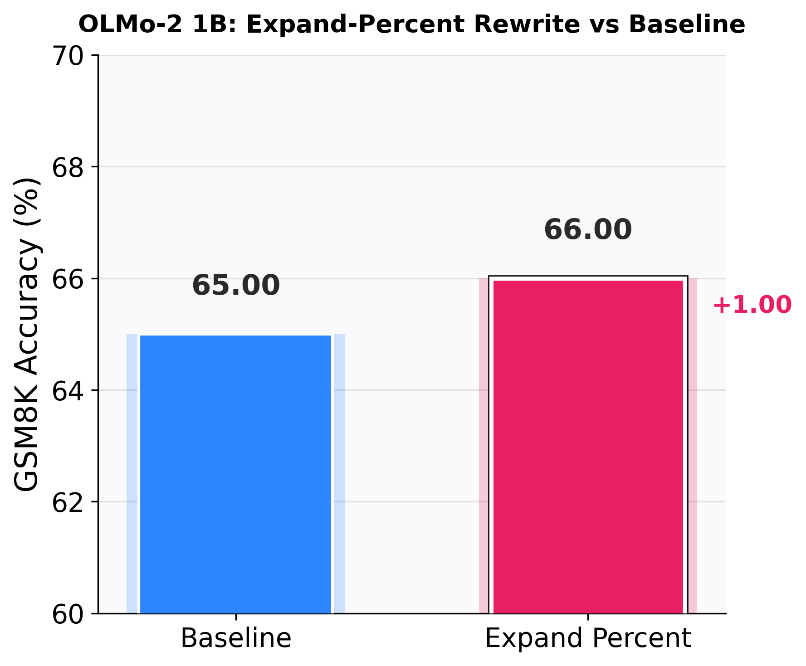
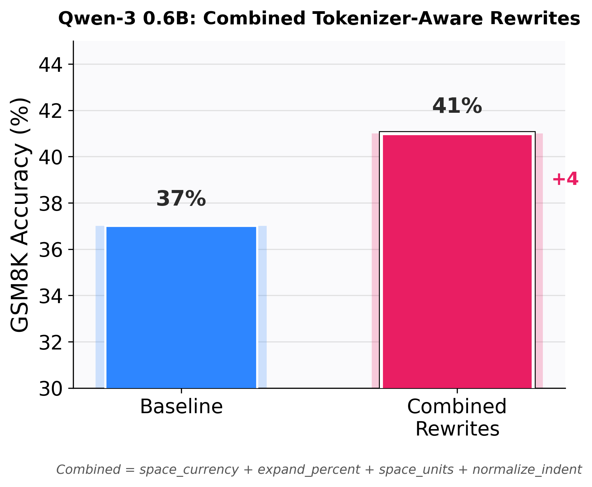

# LLM Pretokenization: Free Gains You Leave on the Table

*This is the written version of a talk I gave at [PyOhio 2026](https://www.pyohio.org/2026/program/talks/llm-token-healing-and-regex/). If you couldn't make it, this post has everything — the regexes, the examples, and the fixes — without needing to squint at slides. Slides are [here](https://docs.google.com/presentation/d/1u_OCxVZzMzTCbRfEEogaqtSYrKMZ58cnR3tvdh0v-n4).*

Most people treat the tokenizer as a fixed black box. Text goes in, token IDs come out, and whatever happens in between is someone else's problem. But there is a step *before* the tokens — a plain regular expression — that quietly shapes how well a model handles your input. Once you can read it, you can exploit it, and in many cases you can get real quality gains **without training anything**.

This post is about that step. I'll cover why there's no "perfect" tokenization, how to read the pretokenization regex, how to format your inputs to cooperate with it, why the right trick for one model is the *exact opposite* of the right trick for another, and where these free inference-time gains hit a hard ceiling (multilingual text) that only retraining can fix. Token healing gets a short mention at the end as a bonus.

## There is no perfect way to tokenize a text

Start with a deceptively simple input:

```
What is 1234567 plus 2?
```

How should the number be split into tokens? Here are three plausible answers:

```
Option A:  123 | 456 | 7             (chunks of 3, left to right)
Option B:  1234 | 56 | 7             (some other chunking)
Option C:  1 | 2 | 3 | 4 | 5 | 6 | 7 (every digit on its own)
```

None of these is *obviously* right. Chunks of three align with how we read large numbers (millions, thousands, ones), but they misalign when the total digit count isn't a multiple of three. Per-digit tokenization is clean for arithmetic but uses more tokens. There's no free lunch — every scheme trades something off.

And critically: **different models made different choices here.** That's not a bug; it's a design decision baked into each tokenizer. Understanding the decision is what lets you use it to your advantage.

## Tokenization vs. pretokenization

First, an important distinction that most people blur together.

**Pretokenization** is how raw text is split into coarse chunks *before* BPE runs. It's done by a regular expression.

**Tokenization** is what BPE does *afterward*, merging within each chunk into final vocabulary tokens.

They're two different jobs, done by two different mechanisms, at two different times. An example makes it concrete:

```
Raw text:    "Visit https://openai.com/research"

     ↓ pretokenization (regex splits into chunks)

Pretokens:   ['Visit', ' https', '://', 'openai.com/research']
             4 chunks

     ↓ tokenization (BPE merges within each chunk)

Tokens:      ['Vis', 'it', ' https', '://', 'open', 'ai', '.', 'com', '/', 'research']
             10 tokens
```

The regex draws the fences. BPE decides how to cut inside each fence. The one rule BPE must obey: **it never merges across a pretoken boundary.** So the pretokenization regex sets hard limits on what the final tokens can be. That's why it matters so much, and why it's worth learning to read.

## How to read the pretokenization regex

Almost every modern LLM uses a variant of the same pattern, inherited from OpenAI's `cl100k` (the GPT-4 tokenizer). Here it is, as used by **OLMo 2** (vocab size 100,352):

```
(?i:'s|'t|'re|'ve|'m|'ll|'d)|[^\r\n\p{L}\p{N}]?\p{L}+|\p{N}{1,3}| ?[^\s\p{L}\p{N}]+[\r\n]*|\s*[\r\n]+|\s+(?!\S)|\s+
```

It looks like line noise, but it's just a list of alternatives separated by `|`, tried left to right. The first branch that matches at the current position wins, consumes those characters, and the process repeats from the next position. There are seven branches:

**1. Contractions** — `(?i:'s|'t|'re|'ve|'m|'ll|'d)`
Matches English contraction suffixes (`'s`, `'ll`, `'ve`, …) as their own tokens, case-insensitively. This branch is first on purpose, so `'s` is grabbed as a contraction before the letters branch can do anything else with it.

**2. Letters** — `[^\r\n\p{L}\p{N}]?\p{L}+`
A run of letters (`\p{L}` = any Unicode letter, in any language), optionally preceded by a single non-letter/non-digit character — usually a leading space. This is why words carry their leading space: ` hello` is one unit.

**3. Digits** — `\p{N}{1,3}`
A run of **1 to 3 digits**. This is the arithmetic-relevant branch, and the one that varies most across models.

**4. Punctuation** — ` ?[^\s\p{L}\p{N}]+[\r\n]*`
A run of characters that are *not* whitespace, letters, or digits — i.e. punctuation and symbols — with an optional leading space and any trailing newlines. This is what makes `://` a single token.

**5. Newline whitespace** — `\s*[\r\n]+`
Whitespace ending in newlines. Handles paragraph breaks.

**6. Trailing whitespace** — `\s+(?!\S)`
One or more whitespace characters *not followed by* a non-whitespace character. The `(?!\S)` is a negative lookahead — it asserts what comes next without consuming it. In plain terms: whitespace at the very end, with nothing real after it.

**7. Leftover whitespace** — `\s+`
Any remaining whitespace. The catch-all fallback.

The three separate whitespace branches (5, 6, 7) exist because order matters: newline-ending whitespace, then trailing whitespace, then everything else. Splitting them lets the tokenizer treat those three cases as distinct token types, because the model learned different behavior for each.

A couple of symbols worth knowing if you want to read these yourself:

- `\p{L}`, `\p{N}`, `\p{M}` are **Unicode property classes**: any Letter, any Number, any combining Mark, across all scripts. (The `\p{...}` notation comes from Perl; the categories come from the Unicode standard.)
- `{1,3}` means "1 to 3 of the preceding"; `+` means "one or more"; `?` means "optional."
- `[^...]` is a negated character class: "any character *except* these."

## Reading the regex tells you how to format your input

Here's the payoff. You can't change the regex on an already-trained model — the model's embeddings were learned for the token sequences its tokenizer produces. But you *can* change what you feed it, so that when the regex splits your text, the chunks are ones the model handles well. I call this **pre-pretokenization**: shaping the input upstream of the pretokenizer.

Each regex branch implies a formatting rule. Here are four, tested on OLMo 2:

**Numbers (branch 3, `\p{N}{1,3}`).** A bare number like `45872103` gets chunked as `458 | 721 | 03` — misaligned with place value. Add thousands separators so it groups cleanly:

```
Input1 (✗):  The population grew to 45872103 people
Input2 (✓):  The population grew to 45,872,103 people
```

```python
import re

def add_thousands_separators(text: str) -> str:
    """OLMo (\p{N}{1,3}): impose right-aligned 3-digit groups."""
    return re.sub(r'(?<!\d)(\d{4,})(?!\d)',
                  lambda m: f"{int(m.group()):,}", text)
```

**Indentation (whitespace branches).** A tab is its own token; four spaces match what the model saw in most Python training data.

```
Input1 (✗):  def foo():\n\treturn 42
Input2 (✓):  def foo():\n    return 42
```

```python
def normalize_indent(text: str) -> str:
    return text.expandtabs(4)
```

**Units (branch 4, punctuation).** `100km` collides the digit run and the letter run; a space separates them cleanly.

```
Input1 (✗):  The car goes 100km/h
Input2 (✓):  The car goes 100 km/h
```

```python
def space_units(text: str) -> str:
    return re.sub(r'(\d)([a-zA-Z]{1,3}\b)', r'\1 \2', text)
```

**Prompt endings (branch 6, trailing whitespace).** A trailing space becomes its own token, and the model then has to predict a non-space-prefixed continuation — statistically rare, since most word tokens carry a leading space. Strip it:

```python
def fix_prompt_end(text: str) -> str:
    return text.rstrip()
```

None of these require training. You're just formatting inputs to cooperate with rules the tokenizer already follows.

## The same trick, reversed: OLMo vs. Qwen

Now the part that makes the whole approach click.

**Qwen 3** (vocab size 151,669) uses a regex that is **identical to OLMo's except one branch**:

```
OLMo:   ... |\p{N}{1,3}| ...      # digit runs of 1-3
Qwen:   ... |\p{N}| ...           # single digit
```

One dropped quantifier — `{1,3}` becomes nothing. That's the entire difference. But it *flips the correct input rewrite completely.*

OLMo chunks digits in threes, so `45872103` splits badly and you want to **add** commas to fix the grouping. Qwen tokenizes every digit on its own, so `45872103` is *already* clean single digits — which is exactly what the arithmetic literature says you want. Adding commas to Qwen input would jam useless punctuation tokens between digits that were already fine. So for Qwen, you do the **exact opposite**: strip the separators.

```
For OLMo:                          For Qwen:
  45872103    ✗                      45,872,103   ✗
  45,872,103  ✓                      45872103     ✓
  Fix: ADD commas                    Fix: REMOVE commas
```

```python
def strip_number_punctuation(text: str) -> str:
    """Qwen (\p{N}): digits already tokenize singly; internal commas
    just add junk punctuation tokens between them. Strip them."""
    return re.sub(r'\d{1,3}(?:[,_ ]\d{3})+',
                  lambda m: re.sub(r'[,_ ]', '', m.group()), text)
```

Same goal — clean number tokenization — opposite operation, entirely because of one regex branch. This is the real lesson of the talk. It isn't "add commas" or "strip commas." It's: **read your model's regex first, because the right move depends on it.** A trick that helps one model can actively hurt another.

This generalizes. OLMo, Llama 3, and Phi-4 all share the identical `cl100k` pattern with `\p{N}{1,3}`, so number rewrites transfer across all three. Qwen is the outlier. You can predict which camp a model is in just by reading one branch of its regex — before running a single token through it.

## Does it actually move the needle?

Theory is nice, but does formatting the input actually change task accuracy? I ran a small ablation on **GSM8K** (grade-school math word problems, which are full of multi-digit numbers, currencies, and percentages — exactly where these rewrites bite), evaluating each model with and without the tokenizer-aware rewrites.

**OLMo 2 1B** with the percentage-expansion rewrite (`20%` → `20 percent`, detaching the `%` from the digit run):



```
baseline:        65.0%
expand percent:  66.0%   (+1.0)
```

**Qwen 3 0.6B** with the combined rewrite bundle (`space_currency` + `expand_percent` + `space_units` + `normalize_indent`):



```
baseline:  37.0%
combined:  41.0%   (+4.0)
```

Both point the right way, and Qwen — the single-digit tokenizer — moves more under the rewrite bundle, which fits the story: its cleaner number tokenization has more to gain from also cleaning up currencies, units, and whitespace.

**One important honesty caveat.** These numbers are from N=100 samples, so the confidence intervals are wide (roughly ±9 points) and neither delta is individually statistically significant. Read them as *directional evidence* consistent with the mechanism, not as a proven effect size. The rewrites also only *fire* on a fraction of GSM8K questions (those that actually contain a number with separators, a `%`, a unit, etc.), so the honest way to read the gain is "on the subset where the rewrite applies, it helps more than it hurts, and it never requires touching the model." If you want to publish hard numbers, rerun at N ≥ 500 and report accuracy on the applicable subset. The point of the experiment isn't the exact percentage — it's that a pure-Python input transformation, derived by reading the regex, nudges accuracy in the predicted direction for free.

## Where the free lunch ends: multilingual text

Numbers and whitespace are fixable at inference. Some things are not, and the clearest example is non-Latin scripts.

The letters branch is `\p{L}+` — one or more *letters*. That works fine for Latin scripts. But Indic scripts (Hindi, Tamil, Telugu) are **abugidas**: a base consonant carries an inherent vowel, and additional vowel sounds attach as *combining marks*. Those marks are Unicode category `\p{M}`, **not** `\p{L}`. So the letters branch grabs the base consonant and then **stops at the combining mark**, tearing the grapheme apart before BPE even runs.

Here's a real Tamil word, `விளையாடுகிறார்கள்` ("they are playing"), pretokenized by the GPT-4 regex:

```
baseline: ['வ', 'ிள', 'ைய', 'ாட', 'ுக', 'ிற', 'ார', '்கள', '்']
```

Nine fragments, with vowel signs sheared off their consonants — linguistically meaningless pieces. Compounded across a whole sentence, this produces a brutal **token tax**: the same meaning costs several times more tokens than English, which eats context window, raises inference cost, and forces the model to reason over incoherent sub-character units.

The fix is a one-category change to the letters branch. Add `\p{M}` so it grabs letters *and* combining marks together:

```
before:  [^\r\n\p{L}\p{N}]?\p{L}+
after:   [^\r\n\p{L}\p{N}\p{M}]?[\p{L}\p{M}]+
```

With that change, the same Tamil word stays whole:

```
fixed: ['விளையாடுகிறார்கள்']   # 1 clean unit
```

Measured over Hindi, Tamil, and Telugu text, the effect is dramatic — and, importantly, it leaves English completely untouched:

| Language | Fertility (baseline → fixed) | Grapheme integrity (baseline → fixed) |
|---|---|---|
| Hindi | 2.00 → 1.09 tok/word | 54% → 100% |
| Tamil | 5.67 → 1.17 tok/word | 26% → 100% |
| Telugu | 4.67 → 1.17 tok/word | 22% → 100% |
| English | 1.11 → 1.11 (unchanged) | 100% → 100% (unchanged) |

Fertility on Tamil drops nearly fivefold; grapheme integrity goes to 100% for all three scripts. And because English is unchanged, the fix is surgical — it helps Indic scripts with no collateral cost elsewhere.

**But here's the catch that keeps this honest:** this is a **training-time** fix. Changing the regex means retraining the tokenizer, and then the model, because the vocabulary changes. Unlike the number rewrites, there is no comma-trick that fixes Tamil fragmentation at inference. You cannot format your way out of it.

That said, reading the regex is *still* free and still useful here — it tells you **which existing model to choose** for a given language. Grep a model's pretokenizer regex for `\p{M}`. Tokenizers that include it (the newer o200k / GPT-4o family does, with a case-aware letter branch that also handles combining marks) fragment Indic scripts far less than the `cl100k` family that OLMo, Llama, and Phi use. So even without retraining, the regex is a cheap, decisive signal for model selection on multilingual tasks. Fewer pretokenization splits means fewer tokens, which means faster and cheaper inference — and usually better quality on that language.

## Bonus: token healing

One more genuinely free, model-agnostic trick, orthogonal to everything above.

When your prompt ends mid-token — say `"...the URL is http"` — the tokenizer forces the boundary on `http`, even though the model would naturally continue into `https`. That forced boundary biases generation toward awkward continuations:

```
Without healing:  "...is http"  →  http | :// | ...   (awkward)
With healing:     "...is http"  →  https | ...        (natural)
```

**Token healing** rewinds the last token of the prompt and lets the model re-choose from a clean boundary. It fixes the *seam* between your prompt and the generation, which is a different problem from how the body of your prompt gets chunked. In HuggingFace it's a single flag:

```python
model.generate(input_ids, token_healing=True, tokenizer=tokenizer)
```

It helps most on completion-style prompts that end mid-token; with chat templates that always end cleanly, the effect is smaller.

## Takeaways

Pretokenization sits upstream of everything the model does. It's cheap to inspect and mostly ignored, which makes it a reliable source of overlooked gains. Concretely:

- **Read the regex.** It's just branches tried in order. One branch (the digit rule) is the difference between OLMo and Qwen.
- **Format inputs to cooperate with it.** Add separators for `\p{N}{1,3}` models, strip them for `\p{N}` models. Fix whitespace and units. Free at inference.
- **The right trick is model-specific.** What helps OLMo hurts Qwen. Always check the regex before applying a rewrite.
- **Know where the ceiling is.** Number and whitespace fixes are inference-time and free. The multilingual `\p{M}` fix is real and measurable, but it needs retraining — though the regex still guides model *selection* for free.
- **Token healing** is a free, model-agnostic win at the prompt/generation boundary.

The longer-term answer may be to drop the hand-written regex entirely — which is exactly what adaptive tokenization approaches like [FlexiTokens](https://arxiv.org/abs/2507.12720) (Owodunni et al., 2026) are after. But until then, the regex is sitting right there in your tokenizer config, and reading it pays for itself.

---

*Abraham Owodunni is a doctoral researcher in CS at Ohio State, working on tokenization, LLM efficiency, and multilingual language models.*
